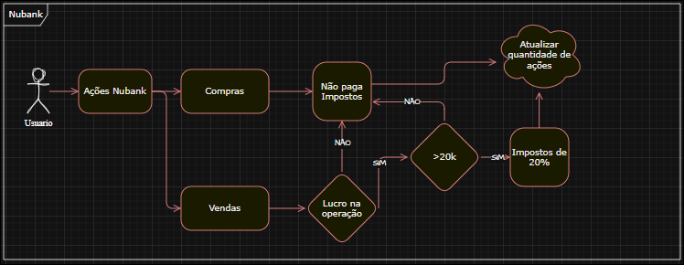

# Code Challenge: Ganho de Capital

## Visão Geral
Este Projeto tem o objetivo de calcular o imposto de operações de compra e venda de ações, imprimindo em CLI em formato JSON cada simulação lida apartir de um documento tipo .txt passado no terminal que esta ativo na aplicação 

 - **Entrada:**  uma ou mais simulação, cada simulação e uma lista em formato Json.
 - - **Saída:** para cada simulação, um array JSON com `{"tax": <valor>}` por operação.
 - **Dependencias:**
   - **Json:** `jackson-databind v_2.17.2`
   - **Testes:** 
     - `junit-jupiter v_5.10.2`
     - `junit v_4.13.2`

## Requisitos
 - **Java** 21 ou apartir do 17 
      - Se preferir usar uma versao antiga do java ajuste no pom pra versao de sua preferencia.
 - **Maven**  3.9.4 ou apartir do 3.8+.
  
   **Build:**
   Em um terminal navegue até a raiz do projeto e digite o comando:
   ```bash
      mvn clean install
   ```
   Isso irá baixar as dependências e criar o binário para a execução do código!
   
   Para uma visualização mais detalhada do que está acontecendo você pode colocar um -X no fim do comando, dessa forma:
   ```bash
      mvn clean install -X
   ```


## Como Execultar o Projeto: 

   Apos a criação do JAR na pasta `target`, vamos seguir esses passos: 

   Voce pode executar o script que disponibilizei aqui da seguinte forma:
      Navege ate a raiz do projeto em um terminal bash, e então execulte:  
   
   ```bash  
      `run.sh`
   ```
   ### O conteudo do dcript é o seguinte:
   
   ```bash
      #!/usr/bin/env bash
      java -jar ./target/nubankDesafioJava-1.0-SNAPSHOT.jar < ./resources/cases/inputCase1.txt
   ```

   Isso ira facilitar os casos de testes do projeto.

   Para executar todos os cenários de teste você pode mudar apenas o número do inputCase no script por exemplo por padrão irei deixar 1 mas você pode alterá-lo assim:

   ```bash
      #!/usr/bin/env bash
      java -jar ./target/nubankDesafioJava-1.0-SNAPSHOT.jar < ./resources/cases/inputCase2.txt
   ```

## Formato de Entrada/Saída

   ### Entrada (Simulação)
   Lista de operações, cada operação `operation`, `unit-cost`, `quantity`.

   ```json
   [
   {"operation":"buy",  "unit-cost":10.00, "quantity": 100},
   {"operation":"sell", "unit-cost":15.00, "quantity":  50}
   ]
   ```

   #### São suportadas tambem entradas com multiplas listas.

   ```json
   [{"operation":"buy", "unit-cost":10.00, "quantity": 100},
   {"operation":"sell", "unit-cost":15.00, "quantity": 100}]
   [{"operation":"buy", "unit-cost":10.00, "quantity": 10000},
   {"operation":"sell", "unit-cost":5.00, "quantity": 1000}]
   ```

   Temos 9 cenários de teste, todos os casos de teste se encontram como arquivos .txt na estrutura do projeto.

   `src\resources\cases\`

   ### Saída
   Mesma cardinalidade da simulação de entrada
   ```json
   [{"tax":0},{"tax":0}]
   ```
   ```json
   [{"tax":0},{"tax":0}]
   [{"tax":0},{"tax":0}]
   ```
   #### Por padrão a saída é compacta em 1 linha

## Regras de Negócio
   - **Compra:**  é isenta de impostos -> atualiza a quantidade de ações.
   - **Venda:**
     - 1 **Prejuizo:** imposto **0** e o valor negativo é acumulado em `accLoss`.
     - 2 **Lucro** e **total da venda ≤ 20.000**: **isento**.
     - 3 **Lucro** e **total da venda > 20.000**: compensa com `accLoss` e aplica **20%** sobre o lucro.



Esse fluxograma representa como as regras de negocios funcionam de maneira simplificada.

## Arquitetura e Estrutura de Pastas

   Inspirada na arquitetura hexagonal:

   ```
   src/main/java/
   ├─ br/nubank/adapters/
   │  ├─ cli/
   │  │  ├─ Main.java
   │  │  └─ CliApp.java
   │  └─ json/
   │     ├─ JacksonJson.java
   │     └─ dto/
   │        ├─ OperationDTO.java
   │        └─ TaxDTO.java
   ├─ br/nubank/application/
   │  └─ CapitalGainsCalculator.java
   └─ br/nubank/domain/
      ├─ Operation.java
      ├─ OperationType.java
      ├─ Portfolio.java
      └─ TaxResult.java
   ```

   ### Essa forma de estrutura foi pensada para facilitar a manutenção, organização e escalabilidade do projeto, facilitando a abstração e desacoplamento das classes, tornando o projeto mais simples de se entender e de apresentar nossas funções ou classes.

   ## Agradecimentos
   Agradeço pela oportunidade de participar do desafio. Foram dias de estudo e aprendizado, pude aplicar alguns dos meus conhecimentos do dia a dia e aprender coisas novas. A experiência de estudar as regras de negócio focando em uma solução simples mas que atendia todos os requisitos foi extremamente valiosa para mim. Estou ansioso pela resposta e de continuar a aprender e me desenvolver com o time de Nubankers que seria não só um objetivo de carreira mas como um sonho realizado. Espero poder contribuir com a missão de descomplicar a vida dos clientes com as melhores soluções e tecnologias do mercado.
